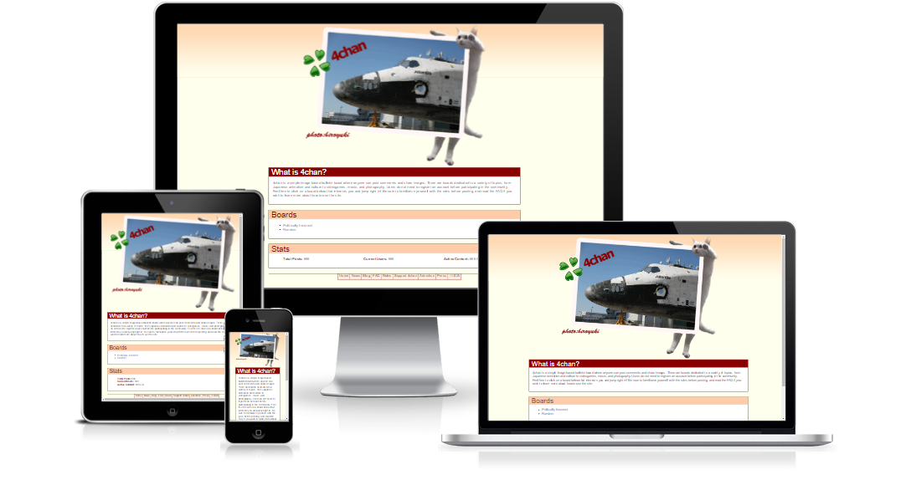

# 4chan-Laravel
===================

 

A 4chan clone that is written in Laravel. Uses Twitter Bootstrap for front-end. 

Getting Started
-------------

You **need** to have [Laravel](https://laravel.com/) to run this site. 

* Create your .env file accordingly 
* composer install
* php artisan migrate
* php artisane db:seed
* php artisan serve

And your off! There is A LOT to be done, not all features of 4chan have been implemented yet, but are indeed in progress. Front-end will not look 100% like 4chan.org , but it will be fairl close. 
